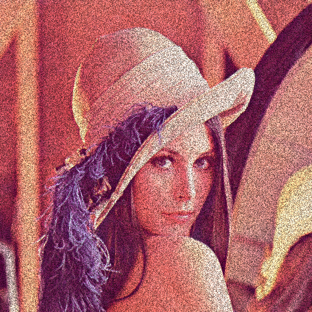
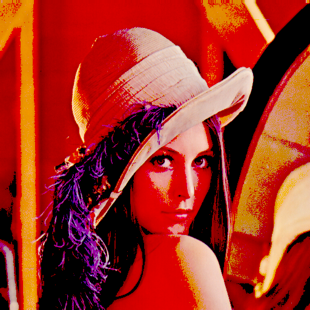
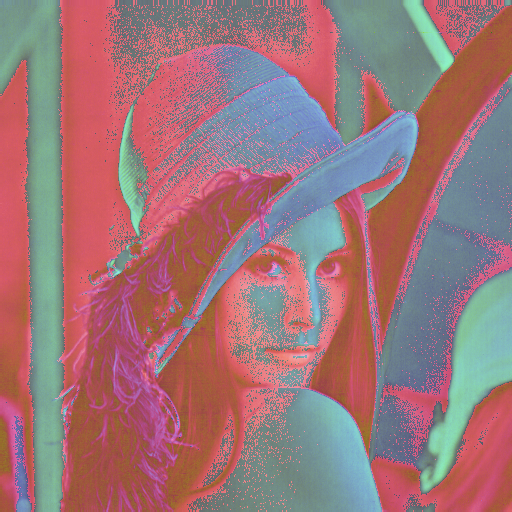
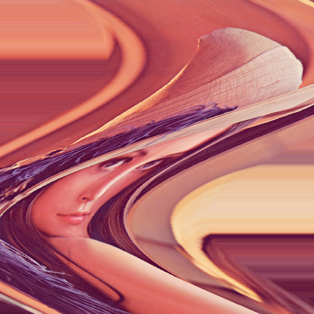
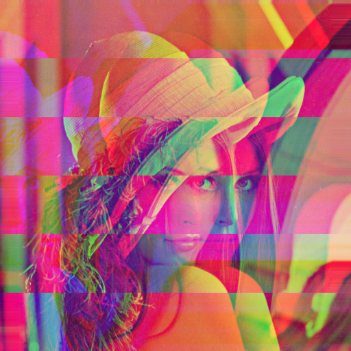
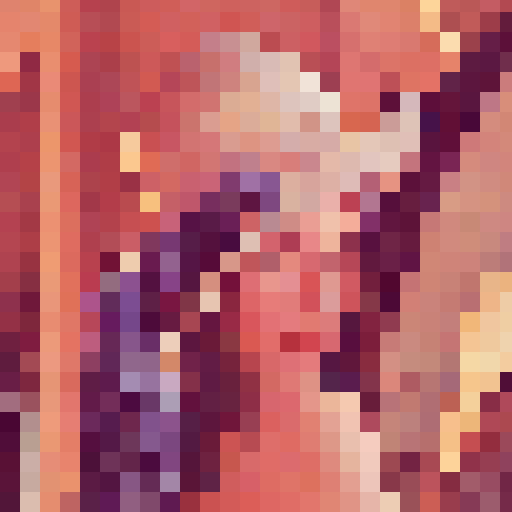

# Alimento Processado

Alimento Processado (alpro) is a web application for live performance of *Glitch Art*. Its goal is to give *Glitch* artists more control over their artistic processes.

The basic ideia behind the project is to create a chain of *Glitch* effects to be applied on top of a base image. These effects are parameterizable to give control over their behavior to the artists.

## The modules

This application is divided into two submodules: **alpro-core** and **alpro-gui**

### A) alpro-core

This is the graphics engine of the application. It takes the base image and applies the effects chain to produce the output image.

It is also a standalone library that you can use to produce outputs programatically, or build your own user interface to interact with it. 

You can see more about how it works [here](./alpro-core/README.md)

### B) alpro-gui

This is the graphical user interface built to interact with the engine above. It allows for the selection of a few diferent types of video sources as the base image, the selection of effects and control over their parameters.

You can see more about how it works [here](./alpro-gui/README.md)

## The Effects

There are 6 effects on the roster, split into two types: *Color* effects and *Position* effetcs. To understand the differences in how they work, check out the documentation for [alpro-core](./alpro-core/README.md).

### Noise
A color effect. Adds RGB noise to the input image.

**Parameters:**
- Noise Factor: Controls the intensity of noise for each color component (red, green or blue) independently.

### Filter

A color effect. An RGB filter that works as either a high pass or low pass filter. As a high pass, it cuts the color of pixels under a determined lower bound. As a low pass, it cuts the color of pixels above a determined upper bound.

**Parameters:**
- High or Low: Selects if the filter acts as high or low pass.
- Threshold: Determines the bound -- upper or lower -- for each color component independently.

### Mapper

A color effect. Maps the pixel color to a chosen color space and mixes it in with the original RGB color.

**Parameters:**
- Color Space: Selects the color space to be mapped to.
- Color Ratio: Controls the ratio between the RGB and selectec color spaces for each color component independently.

### Wobble

A position effect. Deforms the input image following a sine wave along the vertical axis.

**Parameters:**
- Freq: Controls the spacial frquency of the sine wave.
- TimeFreq: Controls the time frequency of the sine wave
- Amp: Controls the horizontal amplitude of the sine wave.

### Tilt

A position effect. Periodically slices the input image and displaces the slices perpendicularly, decoupling the color components.

**Parameters:**
- Direction: Selects if the slices are vertical or horizontal.
- Freq: Controls the time frequency of tilts.
- Amp: Controls the amplitude of displacement.
- Qty: Controls the amount of slices.

### Pixelate

A position effect. Pixelates the image.

**Parameters:**
- Ratio: Controls the ratio to the original resolution for each dimension independently.

