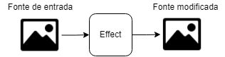
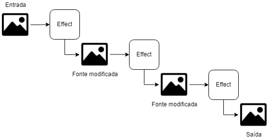

# alpro-core

alpro-core is a graphics engine that allows artists to create *Glitch Art* by applying a chain of effects on top of a base image. It is built on top of [regl](https://github.com/regl-project/regl), a js library that simplifies WebGL to the programmer.

## How it works

The ideia behind this module is to create a chain of parameterizable effects so that each one modifies its input image and exposes the output to the next effect on the chain.

As this project is built on top of WebGL, the effects are defined using fragment shader code and work by sampling pixel colors and modifying them according to the effect parameters. WebGL is responsible for passing tha sahder code to the GPU t omake it run efficiently.

For the chaining to happen, we need to somehow pass the output image of an effect to the next effect on a chain. We do this by creating a single fragment shader for as many effects as we can, given certain constraints.

### *Color* effects and *Position* effects

To understand the constraints mentioned, we need to understand the distinction between what we call a *Color* effect and a *Position* effect.

#### *Color* effects 

These effects work by sampling the color of a pixel, modifying it according to the parameters, and redrwaing it on the same spot of the canvas. These effects can produce outputs like adding noise to the color of a pixel, filtering color or mapping color between diferent color spaces. 

These effects can be chained together endlessly in a single fragment shader. It's like sampling a pixel color, seeing that it's red, applying an effect that changes it to green, then changing the green to an orange, so on and so forth. We can keep doing this forever, and the result would be the same as if we had an output image for each effect and we resampled the color of the input of each effect.

#### *Position* effects

These effects work by getting the position of a pixel, modifying it according to the parameters, then sampling the pixel in the modified position and redrawing it on the original spot on the canvas. These effects can produce outputs like deforming the image according to a function, decoupling color components and reducing the resolution.

These effects cannot be chained together in a single fragment shader. Since we change the position we want to sample the pixel from the image, we need more information than the current color of this single pixel, we need a complete current state of the image. Since we have a complete state of the original base image, we can use one effect of this type at the start of a chain and then use as many *Color* effects as we want.

### Subchains

To allow for the use of as many effects as the user wants, in any order they want, but respecting the constraints described above, we introduce the concept of subchains. The user can create the chain in any fashion, but the engine will break it into subchains in a way so that every *Position* effect is at the start of a subchain, then it will create a fragment shader for each subchain. Then, when applying the chain, it will copy the state of the canvas into a new input image at the end of every subchain. This is a costly process, but the amount of times it needs to happen is upper bounded by the amount of *Position* effects on the chain.

## The API

To allow other programs to interact with the engine, this project exposes an API that allows:

- **Defining a video source**: The API allows for the selection of different types of video sources to serve as the base image for the engine. This includes midia files, like images and videos, and video streams, like a webcam or a virtual cam.
- **Adding, removing and reordering effects**: The API allows for the adding of effects to the end of the chain, removing an effect from a given position, and reordering an effect to a new position
- **Effect editing**: The API allows for the editing of the effects' parameter values
- **Importing and exporting**: The API allows for the importing and exporting of the complete state of the engine, that is, the selected source, the effects on the chain and the values of the effects' parameters.
- **Metadata**: The API allows for the querying of metadata about the video source (name, extension, data), about the effects on the chain (type, id, parameter names, types and values), and about the types of effects available.
