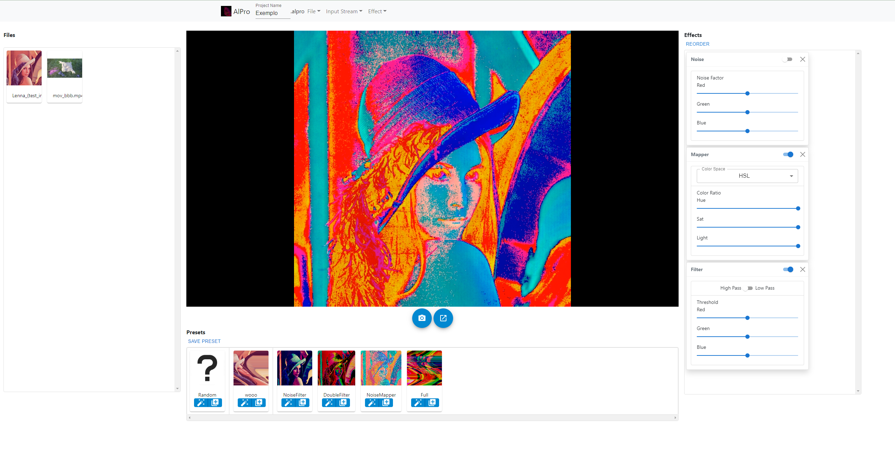

# alpro-gui

alpro-gui is the graphical user interface built to interact with [alpro-core](../alpro-core/). It is built with [React](https://github.com/facebook/react) and uses elements from [React Bootstrap](https://github.com/react-bootstrap/react-bootstrap) and [MUI](https://github.com/mui/material-ui).

